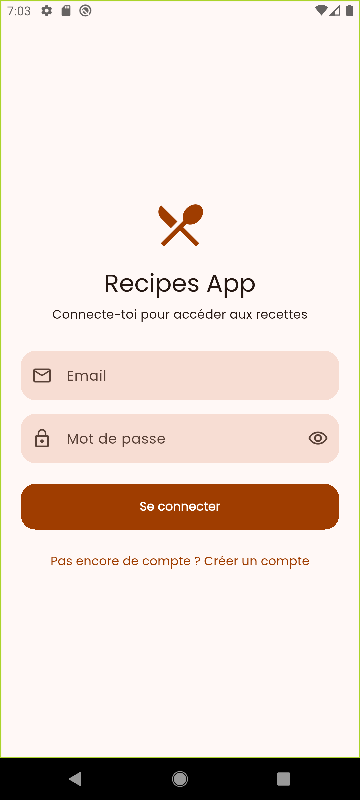
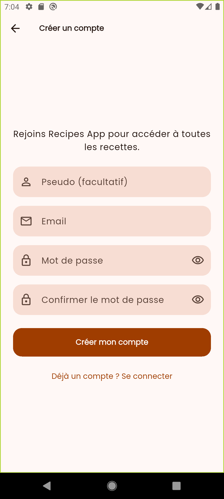
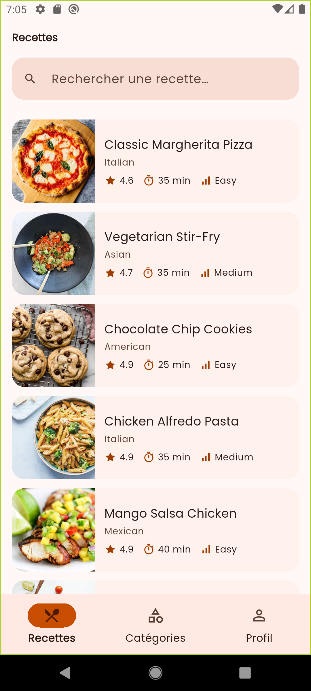
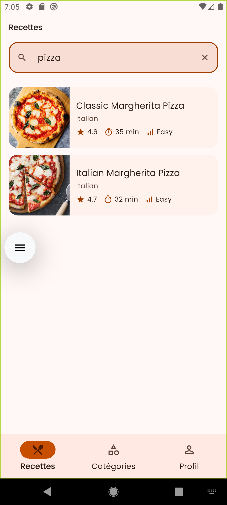
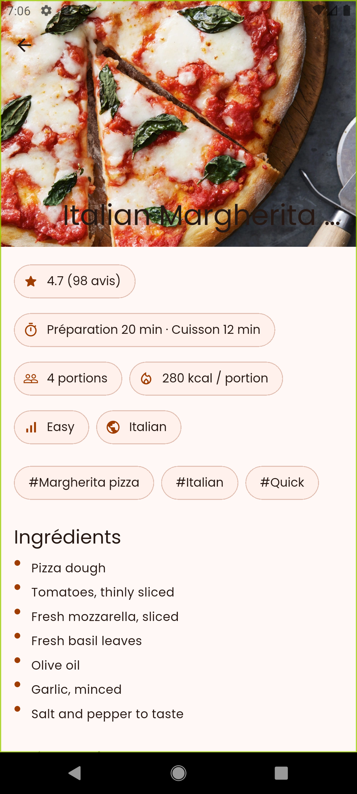
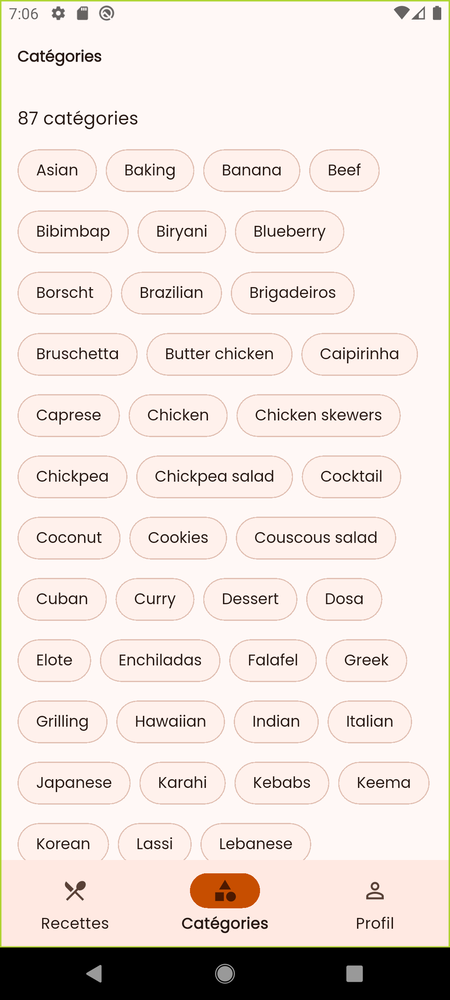
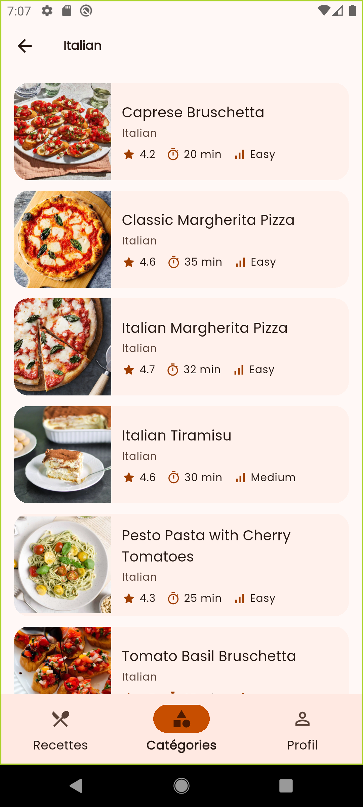
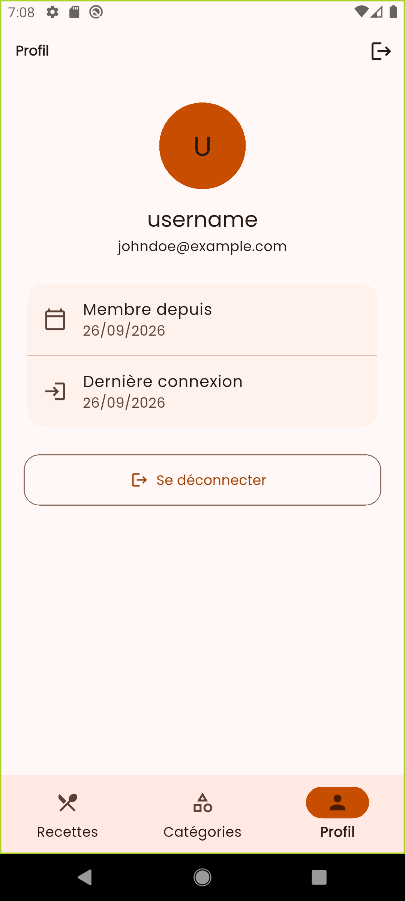
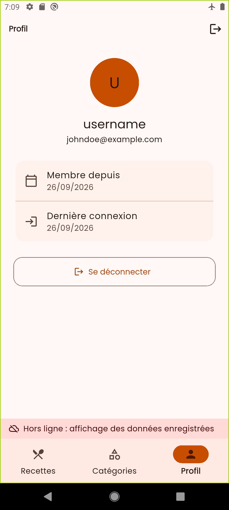

# Recipes App

Application Flutter de recettes de cuisine connectée à un **backend réel (Supabase)** :
authentification JWT, données REST, cache local et mode hors ligne.

> Projet de la **certification 4 « Appels Réseau et APIs »** — FlutterFire Summer Camp 2026 (NextFlutter).

---

## Captures d'écran

| Connexion | Inscription | Liste des recettes |
|:---:|:---:|:---:|
|  |  |  |
| **Recherche** | **Détail** | **Catégories** |
|  |  |  |
| **Recettes d'une catégorie** | **Profil** | **Mode hors ligne** |
|  |  |  |

---

## Fonctionnalités

| Exigence de la certification | Implémentation |
|---|---|
| Authentification login / register / logout (JWT) | Supabase Auth via REST : `/auth/v1/token`, `/auth/v1/signup`, `/auth/v1/logout` |
| Au moins 3 écrans de données REST | **Liste** (pagination + recherche), **Détail**, **Catégories** (+ recettes d'une catégorie), **Profil** |
| Cache local | **Hive CE** (recettes, pages, catégories, profil) + **flutter_secure_storage** (tokens chiffrés) |
| Mode hors ligne | Stratégie *Online-first* : API → cache ; bandeau « Hors ligne » en temps réel |
| Erreurs réseau avec messages utilisateur | `Exception` → `Failure` → message en français + bouton « Réessayer » |
| Clean Architecture / Feature-First + Repository | `core/` + `features/{auth,recipes}/{domain,data,presentation,di}` |
| Dio + intercepteur (token + refresh) | `AuthInterceptor` (`QueuedInterceptor`) : ajoute le Bearer, renouvelle le token, rejoue la requête |
| Au moins 3 tests unitaires (repository) | **13 tests** (`flutter test`) |

Autres points : scroll infini, recherche avec *debounce*, tirer pour rafraîchir, navigation par onglets
(état conservé), thème clair/sombre Material 3, notifications en haut de l'écran, accessibilité (Semantics).

---

## Stack technique

| Besoin | Package |
|---|---|
| HTTP | `dio` |
| Gestion d'état + injection de dépendances | `flutter_riverpod` (Riverpod 3) |
| Navigation | `go_router` (`StatefulShellRoute` pour les onglets) |
| Gestion des erreurs fonctionnelle | `fpdart` (`Either<Failure, T>`) |
| Cache local | `hive_ce`, `hive_ce_flutter` |
| Stockage sécurisé des tokens | `flutter_secure_storage` |
| Connectivité | `connectivity_plus` |
| Police | `google_fonts` |
| Tests | `flutter_test`, `mocktail` |

Backend : **Supabase** (PostgreSQL + PostgREST + Auth), appelé en **REST pur avec Dio** (sans le SDK `supabase_flutter`),
pour maîtriser les en-têtes, l'intercepteur et le refresh du token.

---

## Architecture

Clean Architecture organisée **par feature** :

```
lib/
├── core/                      # Partagé, ne dépend d'aucune feature
│   ├── di/                    # Providers partagés (Dio, stockage, réseau)
│   ├── errors/                # Exceptions (data), Failures (domain), FailureMapper
│   ├── network/               # ApiConstants, DioClient, AuthInterceptor, DioErrorMapper, NetworkInfo
│   ├── storage/               # TokenStorage (chiffré), noms des boîtes Hive
│   ├── theme/                 # Thème Material 3
│   └── widgets/               # ErrorView, EmptyView, OfflineBanner, AppToast
├── features/
│   ├── auth/
│   │   ├── domain/            # User, AuthRepository (contrat), use cases, validateurs
│   │   ├── data/              # Modèles JSON, datasources remote/local, AuthRepositoryImpl
│   │   ├── presentation/      # AuthNotifier, pages (splash, login, register, profil)
│   │   └── di/                # Providers de la feature
│   └── recipes/
│       ├── domain/            # Recipe, RecipePage, RecipeRepository (contrat), use cases
│       ├── data/              # Modèles, RecipeRemoteDataSource, RecipeLocalDataSource, RecipeRepositoryImpl
│       ├── presentation/      # Notifiers/providers, pages, widgets
│       └── di/
├── router/                    # go_router : routes, redirections selon la session, onglets
├── app.dart
└── main.dart
```

**Règle de dépendance :** `presentation → domain ← data`.

- Le **domain** est en Dart pur : entités, contrats (`abstract interface class`) et use cases.
  Il ne connaît ni Flutter, ni Dio, ni Hive.
- La **data** implémente les contrats. Les datasources lancent des `Exception`,
  le repository les convertit en `Failure` et renvoie toujours un `Either<Failure, T>`.
- La **présentation** ne parle qu'aux use cases, via Riverpod.
- Le **routeur** vit dans `lib/router/` (et non dans `core/`) car il importe les pages de toutes les features.

### Authentification et refresh du token

```
Requête ──> AuthInterceptor ajoute « Authorization: Bearer <access_token> »
               │
     réponse 401 (PostgREST) ou 403 bad_jwt (Auth)
               │
               ├─ un autre appel a déjà renouvelé le token ? ──> rejoue avec le nouveau
               └─ sinon POST /auth/v1/token?grant_type=refresh_token
                        ├─ succès      ──> enregistre la NOUVELLE paire, rejoue la requête
                        ├─ pas de réseau ──> garde la session, le repository sert le cache
                        └─ refusé      ──> efface les tokens, retour à l'écran de connexion
```

- `QueuedInterceptor` : si plusieurs requêtes échouent en même temps, **un seul** refresh a lieu
  (le refresh token Supabase est à usage unique).
- Le refresh et le rejeu passent par un second client Dio **sans intercepteur**, pour éviter toute boucle.
- La fin de session est signalée par `SessionEvents` : `core/` ne dépend jamais de la feature auth.

### Mode hors ligne (Online-first)

1. En ligne : appel API, puis mise à jour du cache Hive.
2. Hors ligne ou erreur réseau : lecture du cache (`isFromCache = true` → bandeau à l'écran).
3. Rien en cache : `NetworkFailure` avec un message clair et un bouton « Réessayer ».

Chaque recette est aussi enregistrée individuellement : hors ligne, on peut ouvrir le détail
de toute recette déjà vue et **rechercher** parmi elles.

---

## Installation

### Prérequis

- Flutter **3.38** ou plus récent (Dart 3.10)
- Un compte [Supabase](https://supabase.com) (gratuit)
- Windows : activer le **Mode développeur** (`start ms-settings:developers`), requis par les plugins natifs

### 1. Créer le backend Supabase

1. Crée un projet Supabase.
2. **Authentication → Sign In / Providers → Email** : désactive **Confirm email**.
3. **SQL Editor** : exécute [`supabase/schema.sql`](supabase/schema.sql)
   (table `recipes`, Row Level Security, vue `recipe_tags`).
4. **SQL Editor** : suis les instructions en tête de [`supabase/seed.sql`](supabase/seed.sql)
   pour importer les 50 recettes de [DummyJSON](https://dummyjson.com/recipes).
5. Récupère l'**URL du projet** et la clé **publishable** (`sb_publishable_…`)
   (bouton **Connect** du tableau de bord, ou **Project Settings → API Keys**).

> N'utilise **jamais** la clé `secret` / `service_role` dans l'application.

### 2. Configurer l'application

```bash
git clone https://github.com/TON_PSEUDO/recipes_app.git
cd recipes_app
flutter pub get
cp config/env.example.json config/env.json
```

Remplis `config/env.json` (ce fichier est ignoré par Git) :

```json
{
  "SUPABASE_URL": "https://VOTRE-REF.supabase.co",
  "SUPABASE_KEY": "sb_publishable_xxxxxxxxxxxxxxxx"
}
```

### 3. Lancer

```bash
flutter run --dart-define-from-file=config/env.json
```

Dans VS Code, la configuration **recipes_app** de `.vscode/launch.json` passe déjà ce fichier (touche F5).
Sans configuration, l'app affiche un écran expliquant la commande à utiliser.

---

## Tests

```bash
flutter test
```

| Fichier | Tests |
|---|---|
| `auth_repository_impl_test.dart` | Connexion (succès, identifiants refusés, hors ligne), déconnexion hors ligne, profil depuis le cache |
| `recipe_repository_impl_test.dart` | En ligne + mise en cache, hors ligne, repli sur le cache, cache vide, session expirée, recette introuvable, détail hors ligne |
| `search_recipes_use_case_test.dart` | Recherche trop courte refusée sans appel au repository |

Les dépendances (datasources, stockage, réseau) sont remplacées par des mocks `mocktail`.

---

## Explorer l'API avec Bruno

Le dossier [`bruno/`](bruno/) contient une collection [Bruno](https://www.usebruno.com) de toutes les requêtes
utilisées par l'app (connexion, liste paginée, recherche, détail, catégories, refresh, déconnexion…).

1. Copie `bruno/.env.example` en `bruno/.env` et remplis-le (ignoré par Git).
2. Ouvre le dossier `bruno/` dans Bruno, choisis l'environnement **Supabase**.
3. Lance `A - Verifications / 01 Connexion`, puis les autres requêtes.

---

## Sécurité

- Seule la clé **publishable** est utilisée ; elle est injectée au lancement (`--dart-define-from-file`)
  et n'est pas versionnée.
- Les données sont protégées par la **Row Level Security** : sans token valide, `recipes` renvoie une liste vide.
- Les tokens sont stockés **chiffrés** (Keystore Android / Keychain iOS) ; le cache Hive ne contient que des données publiques.
- À la déconnexion, la session est révoquée côté serveur **et** effacée localement (même hors ligne).

## Limites connues

- Les images sont mises en cache en mémoire uniquement : après un redémarrage hors ligne,
  les photos sont remplacées par une icône (les textes restent disponibles).
- La police Poppins est téléchargée au premier lancement ; hors ligne, la police système est utilisée.

---

Réalisé par **The Teacher** — FlutterFire Summer Camp 2026.
